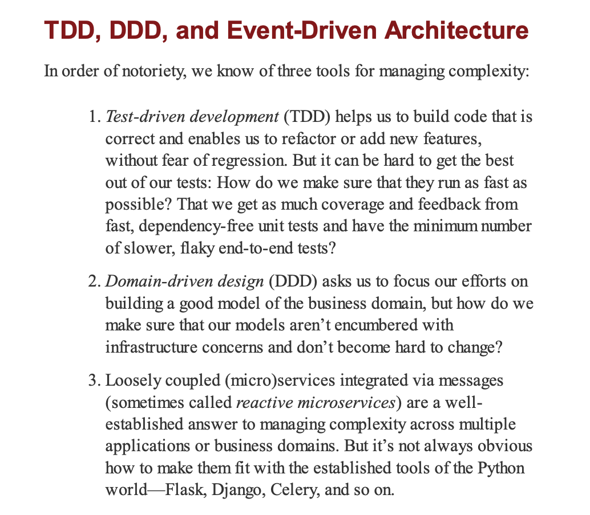

# OOD, TDD, DDD, event-driven architecture
## Domain modeling and DDD (Building an Architecture to Support Domain Modeling)
The goal of the domain modeling is to started with a model that has no external dependencies, but has fast unit tests.

1. OOD is core concept on design your codebase (including OOP terms, SOLID principles and other patterns like Repository?) while DDD is how you use those pieces of code (design) combining them to describe (model) the business elements (domains) and its relationships.
2. DDD is about building a good model of business domain / Event-driven to manage complexity about business domain.

### patterns
These closely related and mutually reinforcing patterns that support our ambition to keep the model free of extraneous dependencies. 
OOD principles are the foundation for the repository and service layer patterns, which are specific architectural patterns used to organize object-oriented systems and enforce key design principles
- Repository pattern - a layer of abstraction around persistent storage
- Service layer pattern - the entrypoints to our system: thin entrypoints to our system, whether it’s a Flask/Fastapi API or a CLI.
- Unit of Work pattern

## Event-Driven architecture
three more mutually reinforcing patterns: the Domain Events, Message Bus, and Handler patterns:
- Domain Events pattern - interactions with a system triggers for other interactions
- Message bus - allow actions (interactions) to trigger Events and call appropriate Handlers

Events can be used as a pattern for integration between services in a microservices architecture