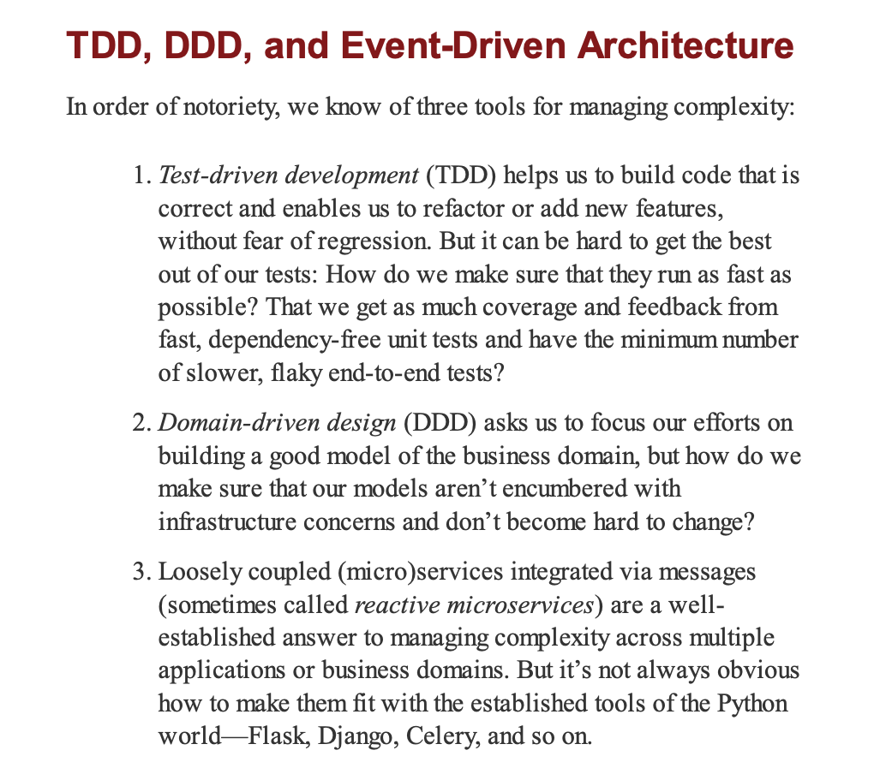
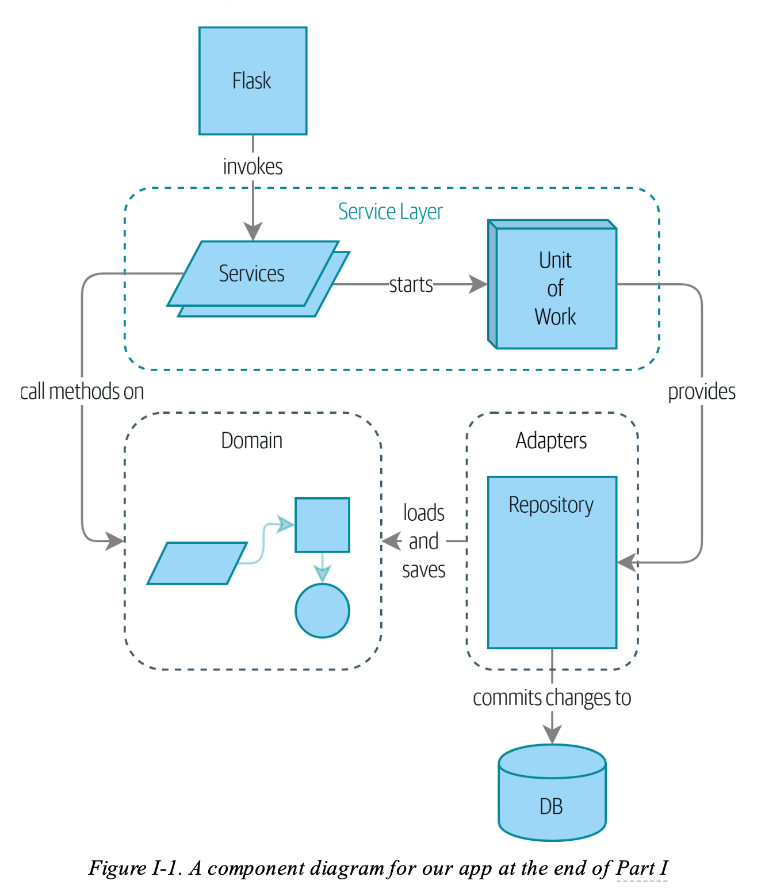
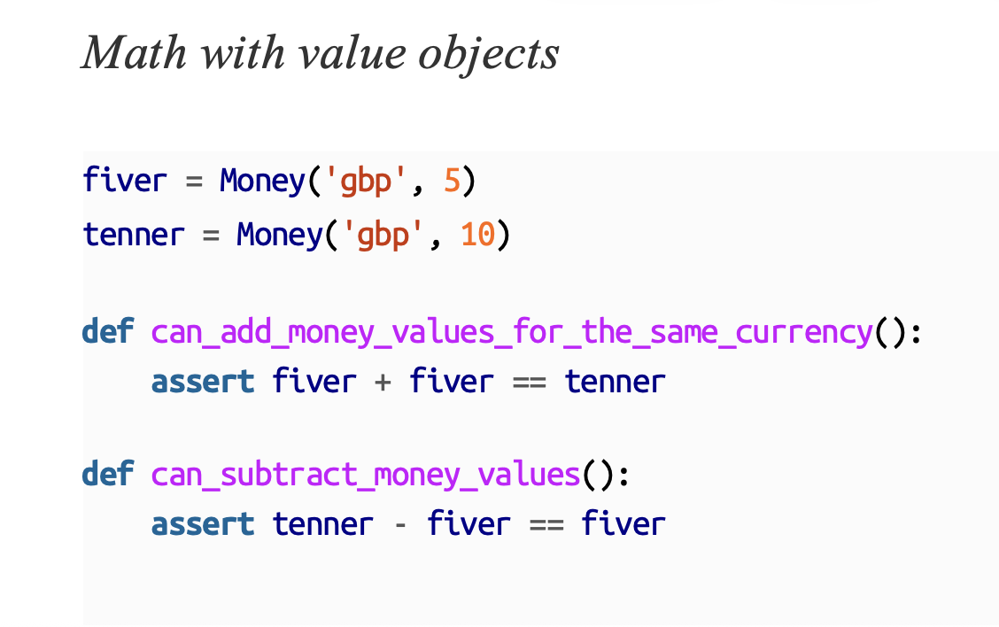

# OOD, TDD, DDD, event-driven architecture


## Domain modeling and DDD (Building an Architecture to Support Domain Modeling)
The goal of the domain modeling is to started with a model that has no external dependencies, but has fast unit tests. We can keep the domain model easy to change and free of low-level concerns by choosing the right abstractions and continuously applying the DIP.


1. OOD is core concept on design your codebase (including OOP terms, SOLID principles and other patterns like Repository?) while DDD is how you use those pieces of code (design) combining them to describe (model) the business elements (domains) and its relationships.
2. DDD is about building a good model of business domain / Event-driven to manage complexity about business domain.
3. Domain Driven Design combines design and development practice, and shows how design and development can work together to create a better solution.

## Repository, Service Layer, and Unit of Work patterns
These three closely related and mutually reinforcing patterns that support our ambition to keep the model free of extraneous dependencies. We build a layer of abstraction around persistent storage, and we build a service layer to define the entrypoints to our system and capture the primary use cases.

### SOLID principles
1. S - single responsibility: класс отвечает за конкретную работу (Square/Triangle/Circle, Output) и должна быть только одна причина для его изменения.
2. O - open-closed: класс д/б открыт для расширения но закртыт для изменений (если расширять то без модификация самого класса - реализовать свои методы вычисления площади для классов разных фигур квадрат, круг и так далее).
3. L - Liskov substitution: каждый производный класс может быть заменен своим родительским или базовым классом без поломки функциональности (класс Пенгвин унаследованный от Птица не должен падать при вызове метода fly следовательно нужно обеспечить дополнительный класс для не летающих птиц таких как пингвин/страус и др). Еще есть History rule: производный класс не должен изменять состояние объекта если это не заложено в родительском (ребенок-человек, но нельзя чтобы он мог летать).
4. I - interface segregation: нет необходимости в доп полях/методах для клиента если он ими не пользуется (пульт с кнопками только для ТВ, только кондиционера и т/д)
5. D - dependency inversion: зависимости должны строиться на абстракциях, а не на конкретных реализациях (хороший пример разделения на слои web/service/DB) см [DIP](#dependency-inversion-principle-dip)


## Event-Driven architecture
Solution to solve временную связность problem.
three more mutually reinforcing patterns: the Domain Events, Message Bus, and Handler patterns:
- Domain Events pattern - interactions with a system triggers for other interactions
- Message bus - allow actions (interactions) to trigger Events and call appropriate Handlers
Events can be used as a pattern for integration between services in a microservices architecture


# Intro
For scientists, though, chaos is characterized by homogeneity (гомогенность/одинаковость/sameness), and order by complexity (отличием/difference - потому что разные объекты должны быть упорядочены и разграничены между собой).

## Encapsulation and Abstractions
Инкапсуляция упрощает методы взаимодействия - упрощают поведение и сокрывают детали реализации. Инкапсулируя поведение мы создаем объект взаимодействия с системой - это пример абстракции. Стремление к higher-level of abstraction (на примере перехода от urllib к requests к использованию библиотеки duckduckgo) создает предпосылки для Encapsulating behavior by using abstractions is a powerful tool for making code more expressive, more testable, and easier to maintain.

### three-layered architecture pattern
Чтобы решить проблему по мере роста приложения чтобы избежать глобальных последствий внося изменения в систему принято разделять на слои:
Web/Presentation (API/CLI) --> Service/Business --> Data model is the pattern for building business apps

*Этот паттерн строится на принципе DIP!*

### Dependency Inversion Principle (DIP)
1. High-level modules (классы/функции и методы которые напрямую взаимодействуют с пользователем) should not depend on low-level modules. Both should depend on abstractions. Business code shouldn’t depend on technical details!
2. Abstractions should not depend on details. Instead, details
should depend on (знает о другом модуле или нуждается в нем) abstractions.

Абстракции - это упрощенные интерфейсы, которые инкапсулируют поведение (подобно тому как модуль
duckduckgo инкапсулировал API поисковой машины).


### Domain Model pattern - место для всей бизнес логики
Решает проблему с тем что бизнес логика (Service/Business layer) разбросана по другим слоям.
Следовательно нужно создавать этот т/н middle layer используя Domain Model pattern.

### patterns
These closely related and mutually reinforcing patterns that support our ambition to keep the model free of extraneous dependencies. 
OOD principles are the foundation for the repository and service layer patterns, which are specific architectural patterns used to organize object-oriented systems and enforce key design principles.

Four _key design patterns_ helps us to build a rich object model with persistence-ignorant code and to keep that model decoupled from technical concerns:

- Repository pattern - a layer of abstraction around persistent storage
- Service layer pattern - the entrypoints to our system, whether it’s a Flask/Fastapi API or a CLI. Also define use cases: where it begins and ends.
- Unit of Work pattern - обеспечивает атомарность ?операцям?
- The Aggregate pattern - ?обеспечение целостности данных? A DDD aggregate is a cluster of domain objects that can be treated as a single unit.




# Domain Modeling
It answers the question: "how we can model business processes with code with TDD compatible way"?

use a few _key patterns_ for modeling domains: 
- Entity: identity equality, domain object that has long-lived identity
- Value Object: value equality, domain object that can be idintified by its data itself, that has no long-livedidentity/UUID.
- Domain Service

Мы заменяем термин business layer на термин __domain model__!

Бизнес говорит на языке сленга и жаргона принятого в отрасли - использует специфичные термины. Термины и жаргоны возникают естественным образом так как это способ описать сложную систему или процесс в одно-два слова или предложения в рамках бизнес-процесса.

Следовательно, Domain - это способ выражения задач бизнеса которую нужно решить в рамках конкретного процесса (закупка/дистрибьюция/склад/etc). Model - это карта процесса с полезными свойствами (property). The domain model is the mental map that business owners have of their businesses. 

Мы создаем т/н _ubiquitous language_ как это мост между business/technology. Мы пользуемся терминологией чтобы упростить коммуникацию и преодолеть сложности процессов опуская детали.

Модель начинается с понимания действий внутри модели в рамках ubiquitous language, в первой итерации мы создаем ключевые объекты взаимодействия: Order/OrderLine/Batch. Далее начинаем думать над валидацией входных данных через призму предложений/messages/jargons:
- Заказ должен иметь ID/SKU, quantity/qty, reference/ref
- Не может быть одинаковых заказов в одину и туже партию/Batch и т/д

### Unit testing - TDD
We construct a model from this business conversation!
When we can identify object by the internal data it represent/store we ca say that it is _Value Object_! So, 
a __value object__ is any domain object that is uniquely identified by the data it holds, and dataclass helps us by providing `__eq__` mothod,
Dataclasses Are Great for Value Objects because it is _value equality_!

In fact, it’scommon to support operations on values, for example


```python
@dataclass(frozen=True)
class Money:
    currency
    amount
# Money is the Value Object
assert Money('gbp', 10) == Money('gbp', 10)
assert Money('gbp', 10) != Money('gbp', 15)
```

We use term _entity_ (entity pattern) to identify domain object that has long-livedidentity. So, entities unlike values have _identity equality_!


Validation is about the preconditions: syntax, semantics, and pragmatics!
