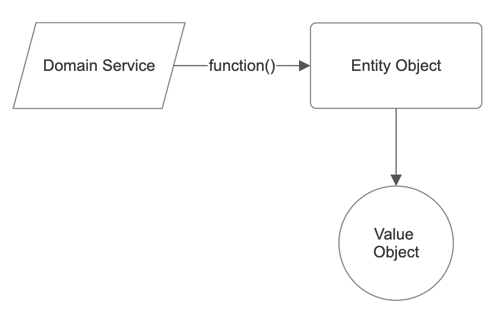

OOD, DDD, event-driven architecture 3/N [TDD]

We start cracking a Domain Model by tuning into business speak. Keeping up a continuous back-and-forth with non-technical experts using the exact same vocabulary is what shapes a so-called Rich Model for us. For instance, mirroring our domain experts' lingo looks something like this:
"Allocate Order to Batch" --> `allocate(Order, Batch)`.

Modeling business processes is all about mapping out a specific domain. But how do we actually translate those business processes into code? Long story short: we need to wrap our heads around the problem first, and only then write the code. There's a killer development workflow for this called Test-Driven Development (TDD). If DDD answers what to build, TDD figures out how. So, we're basically blending the two approaches here.

But first, let’s do a quick recap on Domain-Driven Design and the Cosmic Python way:
1. We shift from the Service Layer (or Business Layer in three-tier architecture) to the Domain Model. From here on out, we'll just call it the Domain Model.
2. We map out the domain using three core architectural patterns: Entities, Value Objects, and Domain Services.

- Entity: Think of a person—an object with a long-lived identity. A person grows up (their attributes change), but they’re still the exact same person. That’s identity equality.
- Value Object: Think of cash. There’s no unique identity here, just raw values. So, \$100 == $100, but $100 != €100`. That's value equality.
- Domain Service: This is a standalone function that doesn't naturally fit inside an Entity or a Value Object. It just drives the business process, often tweaking an Entity using a Value Object.



Speaking Python, I spun up a model in `./model.py` that looks just like this:
```python
from dataclasses import dataclass
from attrs import define, field


@dataclass(frozen=True)
class OrderLine:
    """Value object.
        dataclass handles __eq__ under the hood,
        frozen=True autogenerates __hash__ and keeps it immutable.
    """
    sku: str
    qty: int

@define(eq=False)
class Batch:
    """Entity object.
        @define lets us skip the boilerplate __init__ code.
        eq=False allows us to override __eq__ and __hash__
        for custom identity-based equality.
    """
    reference: str
    sku: str
    qty: int
    _allocations: set['OrderLine'] = field(factory=set, init=False)

    def __eq__(self, other):
        if not isinstance(other, Batch):
            return False
        return other.reference == self.reference

    def __hash__(self):
        return hash(self.reference)
    
    def _allocate():
        pass

def allocate(order_line: OrderLine, batch: Batch):
    """Domain Service function"""
    return batch._allocate(order_line)
```

So, what’s the payoff? We’ve got a Model entirely free of messy third-party dependencies (check out my 2/N post on [DIP]) that speaks pure business lingo! That’s a wrap for now.
At the end, note that a Domain Service function simply represents a business process. In our case (straight out of the Cosmic Python book), we’re playing around with the allocation domain: we source batches in bulk but sell individual orders that get allocated to those batches that match by sku and quantity. Go ahead and whip up a few unit tests for _allocate to feel the power of Domain modeling. I believe it will pay off.