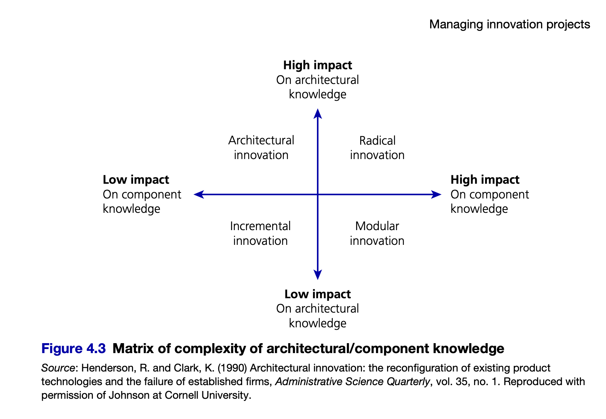
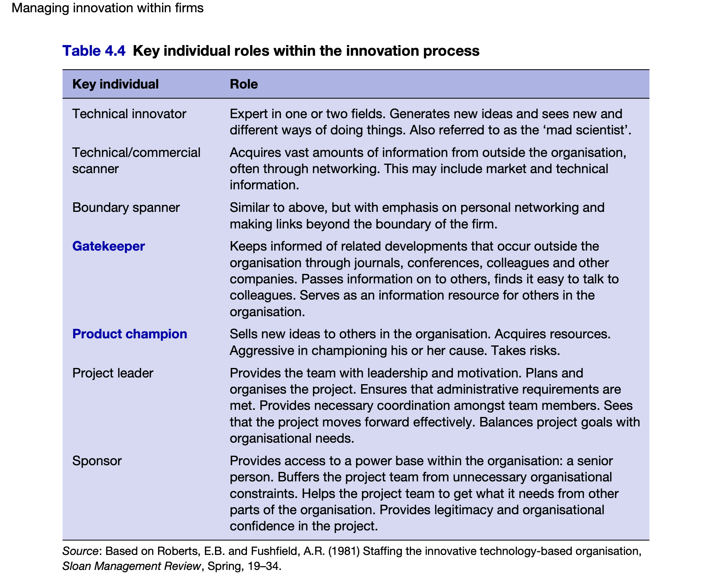

Исследование — это получение новых знаний, даже если применение пока неясно.
«Деятельность квалифицируется как исследования, если её цель — получение новых знаний, а результат заранее неизвестен»
Ключевой инсайт Тротта: Старт R&D — это не решение менеджера, а появление объективных условий: неопределённость + потенциал знания + стратегическая релевантность.

«R&D начинается, когда существует элемент новизны и неопределённости в том, как достичь цели»

Начало с идеи (если за 15 минут не смогли понять можно ли или как сделать) результаты применения или достижимость неизвестна/непредсказуема

A. Техническая неопределенность - риски сроков/бюджета/управления-координации/плохие характеристики
B. Рыночная неопределенность - клиентам не нужно/другой продукт станет стандартом/спрос ниже прогноза

Stage-Gate (Это широко применяемый процесс разработки продукта, который делит усилия на отдельные этапы (stages), разделённые точками принятия решений (gates)) applied at each steps (оценка технической/коммерческой осуществимости - выполняется по ролям)
- applied research (прикладные исследования) - Получение новых знаний без гарантии применения --> PoC
- experimental development (экспериментальная разработка) - Применение знаний для создания продукта/процесса --> prototype

| Критерий                            | Шкала            | Порог для «стоп»                              |
| ----------------------------------- | ---------------- | --------------------------------------------- |
| Стратегическое соответствие         | Да/Нет           | Нет → вынести из портфеля R&D                 |
| Вероятность технического успеха     | 1–10             | <4 → прекратить финансирование                |
| Потенциал создания нового знания    | Да/Нет           |                                               |
| Вероятность коммерческого успеха    | 1–10             | <5 → пересмотреть стратегию                   |
| Синергия с существующими продуктами | 1–10             | <3 → рассмотреть как отдельный проект         |
| Наличие пилотных клиентов           | Да/Нет           | определяет СТО                                |
| Стоимость / Сроки                   | Бюджет / Дедлайн | Превышение на >30% → пересмотреть архитектуру |

Решение «убить проект» должно быть проще, чем «продолжить». Как пишет Тротт: «Знать, когда сказать „стоп“ — важная часть роли менеджера». А Gilbert подчёркивает: интерактивный контроль позволяет принимать такие решения на основе коллективной экспертизы, а не интуиции одного человека. Высокий отсев на ранних этапах — не провал, а признак здорового процесса. Проблема — когда проекты «убивают» на поздних этапах (дорого). Стоит учитывать тонкую грань между клиентоориентированностью и технологическим лидерством.

Метрики:
0. Снижение неопределенности (knowledge milestone)
1. R&D Intensity (Расходы на R&D / Выручка)
2. от CVE до PoC/прототипа (TTM)
3. скорость принятия решений на «гейтах» (cycle time)
4. скорость перехода от R&D к pilot (количество итераций/время)
5. Drop-out rate (Число проектов отвергнутых на гейтах / общее число проектов)

Product Strategy определяет тип инновации/проекта:
- incremental (extend/improve existing tech): 6-18 месяцев до пилота
- radical (create new platform/tech-disrupt): 1-10 лет

Критическая зона — «Долина Смерти» (Valley of Death):
Промежуток между идеей и формальным процессом разработки, где проекты чаще всего умирают из-за нехватки ресурсов. Ключевые роли для преодоления:
Чемпион (Product Champion) — продвигает идею внутри компании (внутренний адвокат идеи - Продвигает идею внутри организации, «продает» концепцию)
Спонсор (Sponsor) — выделяет ресурсы на валидацию (Выделяет ресурсы, защищает проект на уровне руководства)
Гейт-кипер (Gatekeeper) — принимает решение «пускать в формальный процесс или нет» (Принимает решение Go/No-Go на гейте)

